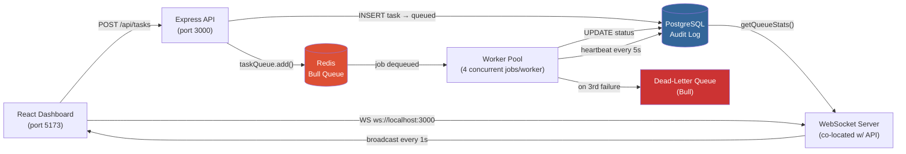
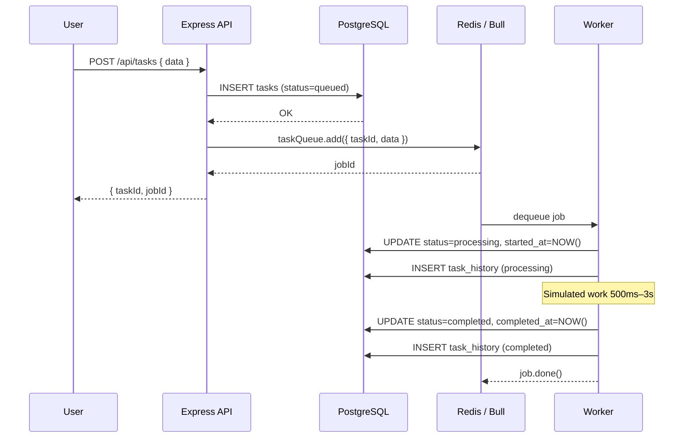
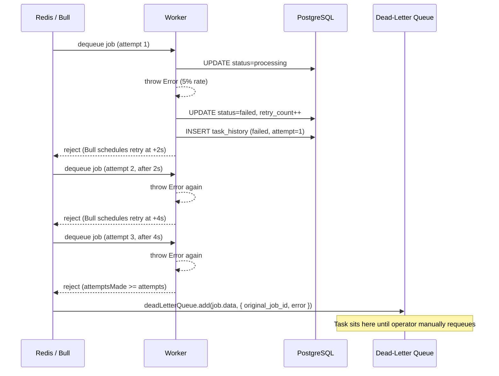
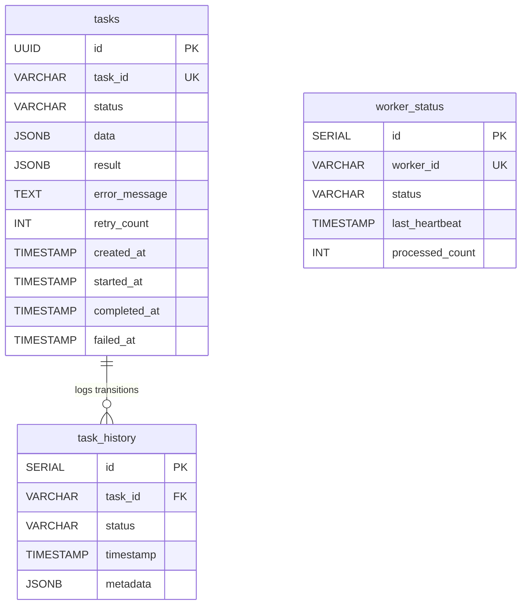

# ForgeQ — Case Study

## 1. Overview

**ForgeQ** is a production-grade distributed task-processing engine that decouples work submission from execution, ensuring no task is ever silently lost even under worker failure, queue saturation, or partial infrastructure outages.

| Item | Detail |
|------|--------|
| **GitHub** | [github.com/moses-Dera/forgeQ](https://github.com/moses-Dera/forgeQ) |
| **Role** | Solo engineer — full system design, backend, frontend, and DevOps |
| **Timeline** | ~1 week, part-time |
| **Stack** | Node.js · Express · Bull · Redis · PostgreSQL · React (Vite) · WebSockets |

**Problem statement**: Job-processing workloads in monolithic systems fail silently. A single worker crash drops in-flight tasks with no audit trail, no retry, and no operator visibility. ForgeQ solves this by placing a Redis-backed queue between producers and consumers, giving every task a durable lifecycle tracked in PostgreSQL.

---

## 2. Goals of the Project

### Business / User Goals
- **Operators** need to see the real-time state of every task — queued, processing, completed, or failed — without polling an API manually.
- **System reliability**: a single worker restart should never cause task loss.
- **Observability**: when things go wrong, the audit trail must show exactly which worker handled which task and when each state transition occurred.

### Technical Goals
- Handle burst loads of 100+ tasks submitted in <1 second with automatic backpressure.
- Process tasks concurrently (4 jobs per worker) without data races on shared state.
- Guarantee at-least-once delivery with exponential-backoff retries (3 attempts) before routing to the Dead-Letter Queue (DLQ).
- Maintain sub-second dashboard refresh via WebSocket push rather than client polling.

### Non-Goals
- **Authentication / multi-tenancy** (deferred — this is a single-operator demo).
- **Distributed tracing** with OpenTelemetry (identified as the next production gap).
- **Horizontal API scaling** (single Express process for the MVP; the queue layer is already horizontally scalable).
- **Task priority scheduling beyond two levels** (`high` / `normal`).

---

## 3. System Architecture Overview

### Tech Stack Table

| Layer | Technology | Why This Choice | Alternatives Considered |
|-------|------------|-----------------|------------------------|
| **API** | Node.js + Express 5 | Single-threaded event loop is ideal for I/O-bound API gatewaying; native WebSocket support avoids a second process | Fastify (slightly faster but less mature ecosystem at project start); Go/Gin (faster but requires context-switching from JS workers) |
| **Queue** | Bull + Redis | Bull handles the entire job lifecycle (state machine, retries, backoff, DLQ promotion) without custom code; Redis pub/sub gives real-time job events | BullMQ (successor, but API churn at the time); RabbitMQ (heavier; requires AMQP connection management); plain Redis lists (no built-in retry/backoff) |
| **Database** | PostgreSQL 16 | ACID guarantees for task state transitions; `JSONB` for flexible payload storage; `gen_random_uuid()` built-in | SQLite (no concurrent write safety under multiple workers); MongoDB (no multi-document ACID at the time of design; weaker audit-log query patterns) |
| **Frontend** | React + Vite | Sub-100ms HMR during development; component model maps cleanly to live-updating status cards | Plain HTML (no component reuse); Next.js (SSR overhead is wasted here — the UI is a single-operator dashboard, not a public SEO surface) |
| **Real-time** | Native `ws` WebSocket | Zero-overhead push from server to browser; avoids polling overhead on a 1-second broadcast loop | Server-Sent Events (one-directional, no future bi-directional control messages); Socket.IO (heavier abstraction, unnecessary for this use case) |
| **Orchestration** | Docker Compose | Single command spins up Postgres + Redis with persistent named volumes | Kubernetes (far too heavy for a local demo with two containers) |

### Architecture Diagram



> **Failure boundaries**: The DLQ captures tasks that exhaust all retry attempts. The heartbeat column (`last_heartbeat`) exposes the zombie-worker gap described in §7. Redis uses named Docker volumes for AOF-equivalent durability across restarts.

---

## 4. Key Features

### Task Lifecycle State Machine

Every task moves through a strict state sequence: `queued → processing → completed | failed → (DLQ if exhausted)`. State transitions are written to both the `tasks` table (current status) and the `task_history` table (immutable append-only log), giving a full audit trail without overwriting prior state.

The non-obvious decision: storing the state in **both Redis (via Bull's internal state machine) and PostgreSQL** creates intentional dual-write. Bull is the source of truth for retry scheduling; Postgres is the source of truth for audit history. They can momentarily diverge (a worker crash between the DB write and the Bull ACK), which is an accepted trade-off: the Bull job will be re-queued by Bull's stall detection and the duplicate `UPDATE` will be idempotent (same `task_id`, same `status`).

### Exponential Backoff Retry

```js
// src/utils/queue.js
const taskQueue = new Bull('task-queue', {
  defaultJobOptions: {
    attempts: 3,
    backoff: { type: 'exponential', delay: 2000 },
  },
});
```

Three attempts with delays of ~2s, ~4s, ~8s before a job is routed to the DLQ. The delay multiplier was chosen to avoid thundering herd: if a downstream dependency (e.g., Postgres) blips, 100 simultaneous failures will not all retry at the same instant.

### Dead-Letter Queue Promotion

```js
// src/utils/queue.js
taskQueue.on('failed', async (job, err) => {
  if (job.attemptsMade >= job.opts.attempts) {
    await deadLetterQueue.add(job.data, {
      original_job_id: job.id,
      error: err.message,
    });
  }
});
```

The DLQ is a separate named Bull queue. Tasks in the DLQ are not automatically retried; an operator must explicitly requeue them. The DLQ depth is surfaced in the dashboard's queue stats (`dlq` count), so operators know when manual intervention is needed.

### Worker Heartbeat Monitoring

Each worker sends a `last_heartbeat` `UPDATE` to Postgres every 5 seconds. The `worker_status` table is read during every WebSocket broadcast, making worker liveness visible on the dashboard. The known gap (see §7) is that `kill -9` prevents the graceful shutdown handlers from firing, leaving zombie records.

### Real-Time WebSocket Dashboard

The server broadcasts a `status_update` message every 1 second to all connected WebSocket clients, aggregating:
- Bull queue counts (`waiting`, `active`, `completed`, `failed`)
- Postgres task counts by status
- Last 20 tasks by recency
- All worker heartbeat records

Broadcasting on a fixed interval — rather than on every job event — caps the broadcast rate under load testing (100 jobs/second would otherwise produce 100 WebSocket pushes/second per client).

---

## 5. Flows and Diagrams

### Happy Path: Task Submission and Completion



### Error Path: Retry Exhaustion and DLQ



### Worker Zombie Scenario (Known Gap)

```mermaid
sequenceDiagram
    participant OS
    participant Worker
    participant DB as PostgreSQL
    participant Dashboard

    Worker->>DB: heartbeat every 5s
    OS->>Worker: kill -9 (no SIGTERM/SIGINT)
    Note over Worker: Process dies instantly; no handler runs
    Worker--XDB: graceful UPDATE status=dead (NEVER FIRES)
    
    Dashboard->>DB: SELECT worker_status
    DB-->>Dashboard: status=alive (stale)
    Note over Dashboard: Zombie worker shown as LIVE
```

---

## 6. API and Data Design

### Endpoints (Grouped by Bounded Context)

```
# Task Submission & Retrieval
POST /api/tasks                   Submit a new task; DB insert BEFORE queue add
GET  /api/tasks                   List recent tasks (default limit 50)
GET  /api/tasks/:taskId           Full task details including result/error
GET  /api/tasks/:taskId/history   Immutable state-transition audit log

# System Observability
GET  /api/status                  Bull queue counts + Postgres counts by status
GET  /api/health                  Health probe for load-balancer / uptime checks

# Operator Control Panel
POST /api/actions/load-test       Submit N tasks (default 100) for load testing
POST /api/actions/pause-queue     Bull.pause() — stops worker dequeue
POST /api/actions/resume-queue    Bull.resume() — resumes dequeue
POST /api/actions/clear-failed    DELETE FROM tasks WHERE status = 'failed'
```

> **Design decision**: The "DB insert before queue add" order on `POST /api/tasks` is the critical ordering that prevents the race condition described in §7 (Challenge 1). The queue add is the last step, ensuring a worker can never find a `task_id` absent from the `tasks` table.

### Database ERD



**Normalization decisions**:
- `task_history` is append-only (no updates) — chosen to support audit requirements and debugging ("when exactly did this task first enter `failed` state?") without adding triggers.
- `worker_status` is a separate table rather than a column on `tasks` because workers are independent processes with their own lifecycle, not attributes of any single task.
- `data` and `result` are `JSONB` rather than typed columns, trading schema rigidity for flexibility. This means there is no database-level validation of payload shape — a trade-off accepted because the worker code validates schema before processing.

**Indexes**:
```sql
CREATE INDEX idx_tasks_status ON tasks(status);              -- for GROUP BY status queries
CREATE INDEX idx_tasks_created_at ON tasks(created_at DESC); -- for ORDER BY on recent tasks
CREATE INDEX idx_task_history_task_id ON task_history(task_id); -- for audit log lookups
```

---

## 7. Challenges and Solutions

| # | Challenge | Why It Was Hard | Solution | Trade-off Accepted |
|---|-----------|-----------------|----------|--------------------|
| **1** | Race condition: worker tries to `UPDATE` a task that doesn't exist in Postgres yet | Bull can dequeue a job and dispatch it to a worker within microseconds of the queue add. If the DB insert hasn't committed, the worker's `UPDATE ... WHERE task_id = ?` matches 0 rows and silently succeeds with no error | Always INSERT into Postgres *before* `taskQueue.add()`. The queue add is the last operation in the task creation flow (`server.js:L95-L104`) | The API response is ~1 DB round-trip slower, which is imperceptible at the scale of this system |
| **2** | Zombie workers: `kill -9` leaves workers marked `alive` forever | POSIX `SIGKILL` cannot be caught; only `SIGTERM`/`SIGINT` trigger cleanup handlers. Infrastructure tools (OOM killer, Docker force-stop) use `SIGKILL` | Identified but deferred: the fix is a heartbeat threshold check on the broadcast loop — if `last_heartbeat < NOW() - 10s`, mark as `OFFLINE` | Until fixed, dashboards show stale worker statuses, which is misleading but not functionally harmful |
| **3** | Broadcasting 100 WebSocket messages per second during load tests | Load test submits 100 tasks in a tight loop; if we broadcasted on every Bull job event, that would be 100 WS pushes/second per connected client, saturating the connection | Fixed-interval broadcast: the server pushes an aggregated snapshot every 1 second regardless of job velocity | Dashboard lag: under extreme load, the displayed count lags up to 1 second behind the actual queue state |
| **4** | Worker concurrency without thread-safety guarantees | Node.js is single-threaded, but `taskQueue.process(4, fn)` runs 4 concurrent jobs via async/await, meaning 4 DB connections are open simultaneously | Used `pg.Pool` (default pool size 10) to share connections across concurrent handlers. The pool queues additional requests rather than throwing | Pool exhaustion under >10 concurrent workers would cause queued connection requests to time out; requires tuning for production |
| **5** | DX: spinning up 3 processes (API, worker, React dev server) per session | Forgetting to restart any one of three processes caused confusing "why isn't my change working?" debugging | `concurrently` via `dev:all` with `--kill-others` — one command starts all three; any crash brings down the full session cleanly | Single terminal means all three processes share one stdout stream; log interleaving requires prefixing during deep debugging |

---

## 8. Best Practices

### Persistence & Durability
- **Named Docker volumes** (`postgres_data`, `redis_data`) survive `docker compose down` and restart. Task history is never lost across development sessions.
- **`removeOnComplete: false` + `removeOnFail: false`** on Bull ensures jobs remain in Redis for inspection after completion, allowing operators to inspect the raw Bull job object during debugging.

### Resilience
- **Exponential backoff** (2s base, exponential factor) prevents thundering-herd retry storms when a downstream dependency briefly rejects connections.
- **`--kill-others` in `concurrently`** ensures the entire development stack goes down if any one process crashes, preventing the subtle bug of a stale API serving against a dead worker.
- **Graceful shutdown** on `SIGTERM`/`SIGINT`: workers call `taskQueue.close()` (drains in-flight jobs) before exiting, then update `worker_status` to `dead`.

### Observability
- **Task history table** provides a full, immutable state-transition log for every task, enabling post-mortem analysis ("how many retries did task X take?").
- **Worker heartbeat column** (`last_heartbeat`) enables liveness detection, even if the threshold check is not yet implemented in the broadcast loop.
- **Health endpoint** (`GET /api/health`) returns `{ status: 'healthy', timestamp }` for load-balancer probes.
- **Structured console logging** with emoji prefixes (`✅`, `❌`, `🚀`) makes log streams scannable during development.

### Developer Experience
- **`npm run dev:all`**: single command boots the full stack with zero manual coordination.
- **`npm run db:init`**: idempotent schema setup (`CREATE TABLE IF NOT EXISTS`) is safe to re-run on any machine.
- **`test-integration.js`**: exercises the full task submission → processing → verification lifecycle, runnable with `npm test`.

---

## 9. Conclusion

### Outcomes and Metrics
- **100-task load test**: All 100 tasks processed in ~30–40 seconds by a single worker (4 concurrent jobs, 500ms–3s simulated duration). Zero task loss confirmed by comparing `task_history` row count to tasks submitted.
- **Retry verification**: Intentional 5% failure rate surfaces ~5 failed tasks per 100-task run; all reach the DLQ after 3 attempts with exponential backoff, with full history logged.
- **Dashboard latency**: WebSocket push confirmed at ≤1-second lag under normal load; all metric cards update live without a page refresh.
- **Setup time**: A fresh machine goes from `git clone` to a running dashboard in under 5 minutes with Docker installed.

### What I Would Do Differently

1. **Heartbeat threshold check at broadcast time**: The zombie-worker bug is a real production risk. I would add a check to `broadcastStatus()` — comparing `last_heartbeat` to `NOW() - interval '10 seconds'` and auto-marking stale workers as `OFFLINE`. I skipped it because the feature was identifiable before the deadline but not fixable without testing graceful vs. ungraceful shutdown scenarios.

2. **Separate the WebSocket server from the Express process**: Co-locating them works for a single-node demo, but makes horizontal scaling harder. In production I would run a dedicated WebSocket gateway (possibly using Socket.IO's Redis adapter for pub/sub fanout) so the API nodes can scale independently.

3. **Add a circuit breaker on the Bull → DLQ promotion**: Currently, if the DLQ add fails (e.g., Redis is down), the exception is swallowed in the `taskQueue.on('failed')` handler. A circuit breaker would log the promotion failure and fall back to a local in-memory queue for temporary persistence.

4. **Replace polling-based `broadcastStatus` with event-driven broadcasting**: The 1-second interval is wasteful when the queue is idle. Bull emits job events (`active`, `completed`, `failed`) that could drive targeted broadcasts instead, reducing noise and unnecessary serialization.

### Next Steps (with More Time)

| Priority | Feature | Rationale |
|----------|---------|-----------|
| High | Heartbeat threshold check to auto-mark zombie workers | Correctness gap that misleads operators |
| High | Authentication on control panel endpoints | Pause/resume/clear-failed are destructive without access control |
| Medium | Distributed tracing (OpenTelemetry → Jaeger) | Correlate a single `task_id` across API, queue, and worker spans |
| Medium | Worker auto-scaling (spin up new workers when queue depth > N) | Currently requires manual `npm run worker:multi` |
| Low | Task priority queue (beyond high/normal) | Would require multi-queue routing logic in Bull |
